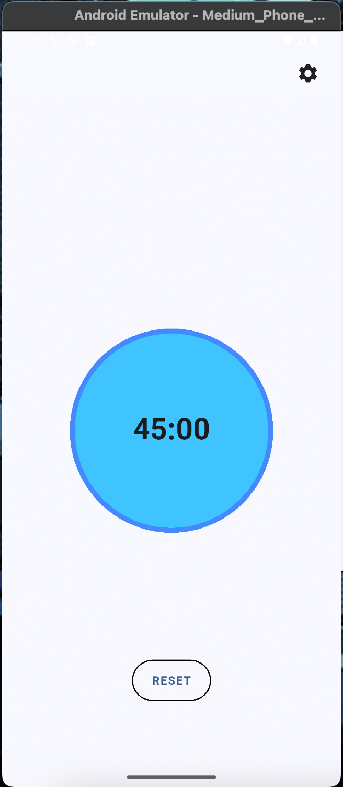
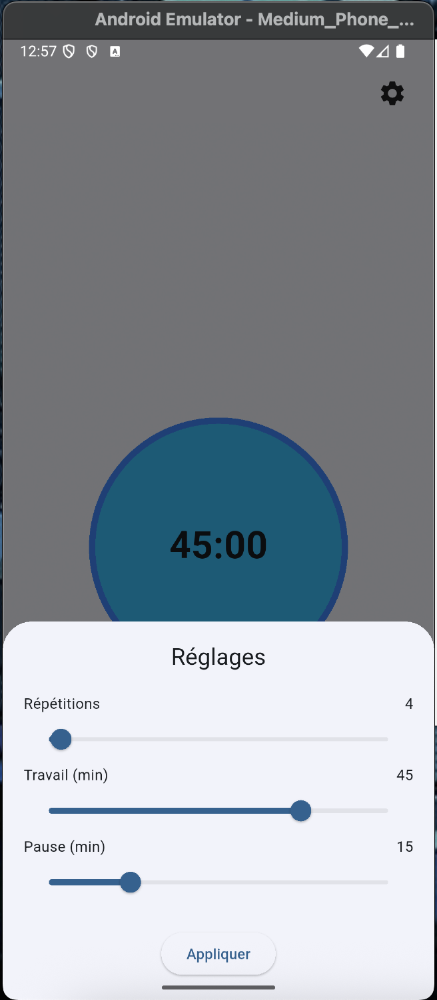

# ⏱️ Pomodoro App – Minimal Focus Timer

Une application mobile simple et élégante pour booster ta concentration grâce à la méthode Pomodoro.  
Développée en **Flutter**, elle allie sobriété, animations douces et interface personnalisable.

---

## ✨ Fonctionnalités

- 🔄 Démarrer / Mettre en pause d’un simple clic sur le cercle
- 🔁 Sessions de travail et pauses en alternance
- 🔊 Indication visuelle de l’état (WORK / PAUSE)
- 💧 Animation subtile de halo apaisant
- 🧮 Suivi des répétitions
- ⚙️ Menu de réglages :
  - Nombre de répétitions (1 à 100)
  - Durée de travail (1 à 60 min)
  - Durée de pause (1 à 60 min)
- 🎨 Effet de texture discret pour une interface plus vivante

---

## 📸 Aperçu

| Écran principal | Menu des réglages |
|-----------------|-------------------|
|  |  |

---

## 📹 Démo vidéo

)

---

## 🛠️ Tech utilisées

- [Flutter 3.29](https://flutter.dev/)
- Dart 3.7
- VSCode

---

## 🙋‍♀️ À propos

Développé en 48h dans le cadre d'une candidature à une alternance en développement mobile.  
Curieuse, autonome et passionnée, je découvre Flutter et j’adore ça !
